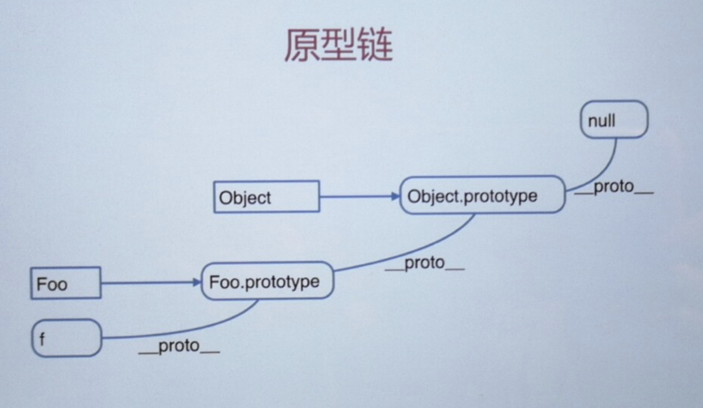
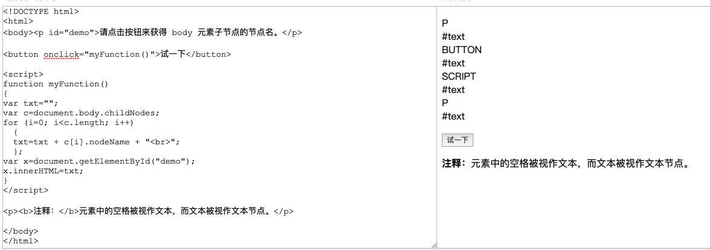
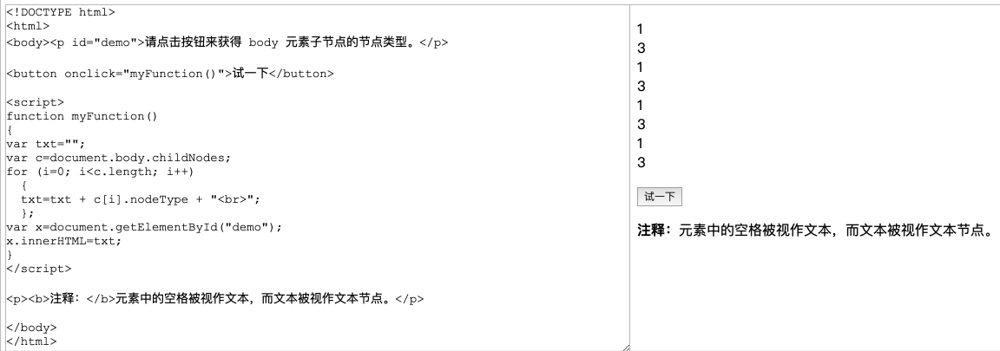
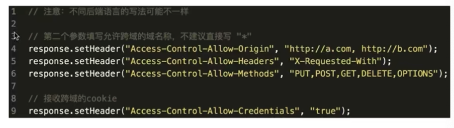

# JavaScript 基础知识点

## 变量类型和计算

### 题目

1. JS中使用typeof能等到哪些类型

   答：undefined、string、number、boolean、object、function。

2. 何时使用 === 何时使用 ==

   ```js
   if(obj.a == null) {
     //这里相当于obj.a === null || obj.a === undefined 的简写
     //jQuery源码中的推荐写法
   }
   ```

3. JS中有哪些内置函数

   答：Object、Array、Number、Boolean、String、Function、Date、RegExp、Error

4. JS变量按照**存储方式**区分为哪些类型，并描述其特点

   答：值类型和引用类型。

   ​	特点：值类型赋值后不会相互干涉，引用类型变量指针赋值后，值修改相互干预

5. 如何理解JSON

   答： JSON 是 js 的对象，还是一种数据格式。

   ```js
   // 对象->字符串
   JSON.stringify({ a: 10, b:20 })  // "{"a":10,"b":20}"
   
   // 字符串->对象
   JSON.parse('{ "a": 10, "b": 20 }')	// {a: 10, b: 20}
   ```

### 知识点

#### 变量类型

**值类型(number，String，Boolean，undefined)**和**引用类型(array，object，function)**

```js
// 值类型
var a = 100
var b = a
a = 200

console.log(b) // 100
console.log(a) //200
```

```js
// 引用类型
var a = {age: 20}
var b = a
b.age = 30

console.log(a.age) // 30
console.log(b.age) // 30
```

值类型和引用类型的**区别**：

1. 值类型是把**值**都存在变量内存的位置，而引用类型是变量通过**指针**指向对象的位置。

2. 引用类型可以无限添加属性。

**typeof 运算符**  (只能区分值类型的详细类型)

```js
typeof undefined // undefined
typeof 'abc' // String
typeof 123 // Number
typeof NaN // Number
typeof true // Boolean
typeof {} // Object
typeof [] // Object
typeof null // Object
typeof console.log // Function
```

**NaN类型** (not a number，属于Number类型)

```js
console.log(1 / 'a') // NaN
console.log(parseInt('abc')) //NaN
```

#### 变量计算----强制类型转换

```js
// 值类型的字符串拼接
var a = 100 + 10 // 110
var b = 100 + '10' // 10010
```

```js
// ==运算符
100 == '100' // true
0 == '' // true
'' == false // true
null == undefined // true
```

```js
// if语句
var a = true
if(a) {
  // ...
}

var b = 100
if(b) { // 100->true
  // ...
}

var c = ''
if(c) { // ''->false
  // ...
}
```

```js
// 逻辑运算
console.log(10 && 0) // 0
console.log('' || 'abc') // 'abc'
console.log(!window.abc) // true

//判断一个变量会被当成 true 还是 false
var a = 100
console.log(!!a) //true
```


## 原型和原型链

### 题目

1. 如何判断一个变量是数组类型

   答：instanceof

   ```javascript {4}
   var arr = []
   arr instanceof Array // true
   typeof arr // object, typeof无法判断是否是数组
   ```

2. 写一个原型链继承的例子

   ```js
   // 动物
   function Animal() {
     this.eat = function () {
       console.log('animal eat')
     }
   }
   
   // 狗
   function Dog() {
     this.bark = function () {
       console.log('dog bark')
     }
   }
   
   Dog.prototype = new Animal()
   // 哈士奇
   var hashiqi = new Dog()
   ```

   ```js
   // 封装一个DOM查询
   function Elem(id) {
     this.elem = document.getElementById(id)
   }
   // 返回hmtl内容
   Elem.prototype.html = function(val) {
     var elem = this.elem
     if(val) {
       elem.innerHTML = val
       return this //返回整个对象  链式操作
     } else {
       return elem.innerHTML
     }
   }
   // 绑定事件
   Elem.prototype.on = function(type, fn) {
     var elem = this.elem
     elem.addEventListener(type, fn)
   }
   
   var div1 = new Elem('div1')
   console.log(div1.html())
   div1.on('click', alert(111))
   ```

3. 描述new一个对象的过程

   答：

   - 创建一个新对象

   - this指向这个对象

   - 执行代码，即对this赋值

   - 返回this

     [^代码]: 详见下边构造函数代码

4. zepto(或其他框架)源码中如何使用原型链

    

### 知识点

#### 构造函数

```js
function Foo(name, age) {
  this.name = name
  this.age = age
  this.class = 'class-1'
  // return this // 默认有这一行
}
var f = new Foo('zhangsan', 28)
// var f1 = new Foo('lisi', 20) // 创建多个对象
```

#### 构造函数-扩展

- var a = {} 其实是var a = new Object()的语法糖
- var b = [] 其实是var b = new Array()的语法糖
- function Foo() {…} 其实是var Foo = new Function(...)
- 使用instanceof判断一个函数是否是一个变量的构造函数

#### 原型规则和示例

1. 所有引用类型(数组，对象，函数），都具备对象特性，即可自由扩展属性(除了"null")。

``` js
var obj = {} obj.a = 100
var arr = [] arr.a = 100
function fn() {}
fn.a = 100
```

2. 所有的引用类型(数组，对象，函数)，都有一个__proto__属性(隐式原型)，属性值是一个普通的对象。

```js
var obj = {} obj.a = 100
var arr = [] arr.a = 100
function fn() {}
fn.a = 100

console.log(obj.__proto__) // 对象
console.log(arr.__proto__) // 对象
console.log(fn.__proto__) // 方法
```

3. 所有的函数，都有一个**prototype**属性(显式原型)，属性值也是一个普通的对象。

``` js
var obj = {} obj.a = 100
var arr = [] arr.a = 100
function fn() {}
fn.a = 100

console.log(fn.prototype) // 对象
```

4. 所有的引用类型(数组，对象，函数)，__proto__属性值指向他们构造函数的"prototype"属性值。

``` js
var obj = {} obj.a = 100
var arr = [] arr.a = 100
function fn() {}
fn.a = 100

console.log(obj.__proto__ === Object.prototype) // true
console.log(arr.__proto__ === Array.prototype) // true
console.log(fn.__proto__ === Function.prototype) // true
```

5. 当试图得到一个对象的某个属性时，如果这个对象本身没有这个属性，那么会去它的**__proto__**(即它的构造函数的prototype)中寻找。

``` js
// 构造函数
function Foo(name, age) {
  this.name = name
}
Foo.prototype.alertName = function() {
  alert(this.name)
}
// 创建示例
var f = new Foo('zhangsan')
f.printName = function() {
  console.log(this.name)
}
// 测试
f.printName() // zhangsan
f.alertName() // alert(zhangsan)
```

``` js
var item
for (item in f) {
  // 高级浏览器已经在for in 中屏蔽了来自原型的属性
  // 但是这里还是建议加上这个判断，保证程序的健壮性
  console.log(item) // 结果：name printName alertName
  console.log('~~~~~~~~我是分割线~~~~~~~~~')
  if (f.hasOwnProperty(item)) {
    console.log(item) // 结果：name printName
  }
}
```

#### 原型链

```js
// 构造函数
function Foo(name, age) {
  this.name = name
}
Foo.prototype.alertName = function() {
  alert(this.name)
}
// 创建示例
var f = new Foo('zhangsan')
f.printName = function() {
  console.log(this.name)
}
// 测试
f.printName() // zhangsan
f.alertName() // alert(zhangsan)

f.toString() // 要去f.__proto__.__proto__中查找，结果为：[object Object]
```



[^直角方块]: 构造函数
[^圆角方块]: 对象

#### instanceof

用途：判断 **引用类型** 属于哪个 **构造函数** 的方法。


## 作用域和闭包

```js
console.log(a) // undefined
var a = 100;

fn() // undefined
function fn() {
  // 声明
}

fn1() // fn1 is not a function
var fn1 = function() {
  // 表达式
}
```

```js
fn('zhangsan')
function fn(name) {
  console.log(this) // Window
  console.log(arguments) // 参数“zhangsan”
  
  var age = 20
  console.log(name, age) // zhangsan 20
  
  bar(100)
  function bar(num) {
    console.log(num) // 100
  }
}
```

### 题目

1. 说一下对变量提升的理解

   - 变量定义
   - 函数声明(注意和函数表达式的区别)

2. 说明this几种不同的使用场景

   - 作为构造函数执行
   - 作为对象属性执行
   - 作为普通函数执行
   - call apply bind

3. 创建10个<a>标签，点击的时候弹出对应的序号

   ```js
   // 错误写法
   var i, a
   for(i=0; i<10; i++) {
     a = document.createElement('a')
     a.innerHTML = i + '<br>'
     a.addEventListener('click', function(e){
       e.preventDefault()
       alert(i) // 9
     })
     doucument.body.appendChild(a)
   }
   
   // 正确写法
   var i
   for(i=0; i<10; i++) {
     (function(i) {
       var a = document.createElement('a')
       a.innerHTML = i + '<br>'
       a.addEventListener('click', function(e){
         e.preventDefault()
         alert(i) // 9
       })
       doucument.body.appendChild(a)
     })(i)
   }
   
   ```

4. 如何理解作用域

   - 自由变量
   - 作用域链，即自由变量的查找
   - 闭包的两个场景

5. 实际开发中闭包的应用

   ```js
   // 闭包实际应用中主要用于封装变量，收敛权限！！！
   function isFirstLoad() {
     var _list = []
     return function(id) {
       if(_list.indexOf(id) >= 0 ) {
         return false
       }else {
         _list.push(id)
         return true
       }
     }
   }
   
   // 使用
   var firstLoad = isFirstLoad()
   firstLoad(10) //true
   firstLoad(10) //false
   firstLoad(20) //true
   ```

### 知识点

#### 执行上下文

```js
console.log(a) // undefined
var a = 100

fn('zhangsan') // 'zhangsan' 20
function fn() {
  age = 20
  console.log(name, age)
  var age
}
```

- 范围：一般<script>或者一个函数

- 全局：变量定义、函数声明

- 函数：变量定义、函数声明、this、arguments

  **注意：函数声明和函数表达式的区别！！！**

#### this

- this要在执行时才能确认值，定义时无法确认

  ```js
  var a = {
    name: 'A',
    fn: function() {
      console.log(this.name)
    }
  }
  a.fn() // this === a
  a.fn.call({name: B}) // this === {name: 'B'}
  var fn1 = a.fn
  fn1() //this === window
  ```

- this的使用场景

  - 作为构造函数执行
  - 作为对象属性执行
  - 作为普通函数执行
  - call、apply、bind

  ```js
  // 构造函数
  function fn(name) {
    this.name = name
    // return this
  }
  var f1 = new fn('zhangsan')
  
  // 对象
  var obj = {
    name: 'A',
    printName: function() {
      console.log(this.name)
    }
  }
  obj.printName() // A
  
  // 普通函数
  var a = 1
  function Fun() {
    console.log(this.a) // 1
  }
  
  //call apply bind
  function fn1(name, age) {
    alert(name) // 'zhangsan'
    alert(age) // 28
    console.log(this) // {x: 100}
  }
  fn1.call({x: 100}, 'zhangsan', 28) // 
  fn1.apply({x: 100}, ['zhangsan', 28])
  // call 和 apply区别在于传递参数形式不同
  
  var f2 = function(name, age) {
    alert(name) // 'lisi'
    alert(age) // 19
    console.log(this) // {y: 100}
  }.bind({y: 100})
  f2('lisi', 19)
  ```

  **apply、call、bind区别**

  语法如下：

  ```js
  // apply和call改变函数内部this的指向
  // apply()
  function.apply(thisobj, [arg1, arg2...])
  
  // call()
  function.call(thisobj, arg1, arg2...)
  
  // bind()
  // 返回一个新函数，该函数内部this为传入的第一个参数,之后的参数会作为参数传入
  function.bind(thisobj, arg1, arg2)
  ```

#### 作用域

```js
// 无块级作用域
if(true) {
  var name = 'lisi'
}
console.log(name) //lisi

// 函数和全局作用域
var a = 100
function fn() {
  var a = 200
  console.log('fn', a)
}
console.log('global', a) // 'global' 100
fn() // 'fn' 200
```

#### 作用域链

```js
var a = 100
function fn() {
  var b = 200
  // 当前作用域没有定义的变量，即为“自由变量”
  console.log(a)
  console.log(b)
}
fn() // 100 200
```

#### 闭包

闭包是一个能访问其他函数内部变量的函数。


## 异步和单线程

### 题目

1. 同步和异步的区别是什么？分别举例一个同步和异步的例子。

   - 同步会阻塞代码的执行，而异步不会
   - alert是同步，setTimeout是异步

2. 一个关于settimeout的笔试题。

   ```js
   console.log(1)
   setTimeout(function(){
     console.log(2)
   },0)
   console.log(3)
   setTimeout(function(){
     console.log(4)
   },1000)
   console.log(5) // 打印顺序：1 3 5 2 4
   ```

3. 前端使用异步的场景有哪些。

   答案见下。

### 知识点

1. 什么是异步

```js
console.log(100)
setTimeout(function(){
  console.log(200)
},1000)
console.log(300) // 打印顺序：100 300 200
```

2. 前端使用异步的场景
   - 定时任务：setTimeout、setInterval
   - 网络请求：ajax请求、动态加载
   - 事件绑定


## 其他知识

### 题目

1. 获取2017-06-10格式的日期

   ```js
   function formatDate(dt) {
     if(!dt) {
       dt = new Date()
     }
     var year = dt.getFullYear()
     var month = dt.getMonth() + 1
     var date = dt.getDate()
     if(month < 10) {
       month = '0' + month
     }
     if(date < 10) {
       date = '0' + date
     }
     return year + '-' + month + '-' + date
   }
   var dt = new Date()
   var formatDate = formatDate(dt)
   console.log(formatDate)
   ```

2. 获取随机数要求长度一致的字符串格式

   ```js
   var random = Math.random()
   var random = random + '0000000000'
   var random = random.slice(0, 10)
   console.log(random)
   ```

3. 写一个能遍历对象和数组的通用forEach函数

   ```js
   function forEach(obj, fn) {
     var key
     if(obj instanceof Array) {
       obj.forEach(function(item, index) {
         fn(index, item)
       })
     }else {
       for(key in obj) {
         fn(key, obj[key])
       }
     }
   }
   
   // 调用
   var arr = [1, 2, 3]
   forEach(arr, function(item, index){
     console.log(item, index)
   })
   
   var obj = {x: 100, y: 200}
   forEach(obj, function(key, value) {
     console.log(key, value)
   })
   ```

### 知识点

#### 日期

```js
Date.now() // 获取当前时间的毫秒
var dt = new Date()
dt.getTime() // 获取毫秒数
dt.getFullYear() // 年
dt.getMonth() // 月 (0-11)
dt.getDate() // 日 (0-31)
dt.getHours() // 小时 (0-23)
dt.getMinutes() // 分钟 (0-59)
dt.getSeconds() //秒 (0-59)
```

#### Math

```js
// 获取随机数
Math.random() // 0<x<1

// 向下取整
Math.floor(x)

// 向上取整
Math.ceil(x)

// 绝对数
Math.abs(x)

// 四舍五入取整
Math.round(x)
```

#### 数组API

- `join` 组合 ( 原数组不变 )
- `pop` 和 `push` 末尾`移除`一项 和 `添加`任意长度 ( 原数组改变 )
- `shift` 和 `unshift` 开头`移除`和`添加`任意长度 ( 原数组改变 )
- `sort` 排序 ( 原数组不变 )
- `reverse` 逆序 ( 原数组改变 )
- `concat` 组合 ( 原数组不变 )
- `slice` 截取 ( 原数组不变 )
- `splice`  删除、插入和替换 ( 原数组不变 )
- `indexOf` 和 `lastIndexOf`
- `forEach` 遍历所有元素 ( ES5新增 )
- `every` 判断所有元素是否都符合条件 ( ES5新增 )
- `some` 判断是否有至少一个元素符合条件 ( ES5新增 )
- `map` 对元素重新组装，生成新数组 ( ES5新增 )
- `filter` 过滤符合条件的元素 ( ES5新增 )

```js
// join
var arr = [1, 2, 3]
console.log(arr.join()) // '1,2,3'
console.log(arr.join('-')) // '1-2-3
console.log(arr) // [1, 2, 3]  ( 原数组不变 )

// pop 和 push
var arr = ['lily', 'Tom', 'Jan']
arr.push('Mark', 'Max')
console.log(arr) // ['lily', 'Tom', 'jan', 'Mark', 'Max']

arr.pop()
console.log(arr) // ['lily', 'Tom', 'jan', 'Mark']


//shift 和 unshift
var arr = ['lily', 'Tom', 'Jan']
arr.unshift('Mark', 'Max')
console.log(arr) // ['Mark', 'Max', 'lily', 'Tom', 'Jan']

arr.shift()
console.log(arr) // ['Max', 'lily', 'Tom', 'Jan']


// sort 排序
var arr = [1, 4, 2, 3, 5]
var arr2 = arr.sort(function(a, b) {
  // 从小到大
  return a - b
  
  // 从大到小
  // return b - a
})
console.log(arr2)


// reverse 逆序
var arr = [1, 2, 3, 4]
arr.reverse()
console.log(arr) // [4, 3, 2, 1]


// concat 组合
var arr = [1, 2, 3, 4]
var arrConcat = arr.concat(5, [6, 7])
console.log(arrConcat) // [1, 2, 3, 4, 5, 6, 7]
console.log(arr) // [1, 2, 3, 4]


// slice 截取
var arr = [1,3,5,7,9,11];
var arrCopy = arr.slice(1);
var arrCopy2 = arr.slice(1,4);
var arrCopy3 = arr.slice(1,-2);
var arrCopy4 = arr.slice(-4,-1);

console.log(arr); //[1, 3, 5, 7, 9, 11](原数组没变)
console.log(arrCopy); //[3, 5, 7, 9, 11]
console.log(arrCopy2); //[3, 5, 7]
console.log(arrCopy3); //[3, 5, 7]
console.log(arrCopy4); //[5, 7, 9]


// splice 删除、插入和替换


// indexOf 和 lastIndexOf
// 两个参数：第一个参数“要查找的项” 第二个参数“（可选）表示查找起点位置的索引”
var arr = [1,3,5,7,7,5,3,1];
console.log(arr.indexOf(5)); //2
console.log(arr.lastIndexOf(5)); //5
console.log(arr.indexOf(5,2)); //2
console.log(arr.lastIndexOf(5,4)); //2
console.log(arr.indexOf("5")); //-1


// forEach循环
var arr = [1, 2, 3]
arr.forEach(function(item, index) {
  console.log(index, item)
})


// evary
var arr = [1, 2, 3]
var result = arr.every(function(item, index) {
  // 用来判断所有的数组元素，都满足一个条件
  if(item < 4) {
    return true
  }
})
console.log(result)


// map
var arr = [1, 2, 3, 4]
var arr2 = arr.map(function(item, index) {
  // 将元素重新组装，并返回
  return '<b>' + item + '</b>' 
})
console.log(arr2)

// filter
var arr = [1, 2, 3]
var arr3 = arr.filter(function(item, index) {
  if(item >= 2) {
    return true
  }
})
console.log(arr3) // [2, 3]
```

#### 对象API

```js
var obj = {
  x: 100,
  y: 200,
  z: 300
}
var key
for(key in obj) {
  if(obj.hasOwnProperty(key)) {
    console.log(key, obj[key])
  }
}
// x 100
// y 200
// z 300
```


# JS-Web-API

## DOM操作

Document  Object  Model

### 题目

1. DOM是那种基本的数据结构

   树形结构

2. DOM操作的常见API有哪些

   - 获取DOM节点，以及节点的property和attribute
   - 获取父子节点
   - 新增和删除节点

3. DOM节点的attribute和property有何区别

   property 是对 js 对象属性的修改

   attribute 是对 html 标签属性的修改

### 知识点

#### DOM的本质

Document   Object   Model

DOM可以理解为：

​	浏览器把拿到的Html代码，结构化成了一个浏览器能识别并且js可操作的一个模型而已。

####DOM节点操作

```	js
// 获取dom
var div1 = document.getElementById('div1') // 元素

var divList = document.getElementsByTagName('div') // 结合(动态)

var containerList = document.getElementsByClassName('.container') // 结合

var pList = document.querySelectorAll('p') // 集合(静态)


```

`getElementsByTagName` 和 `querySelectorAll` 区别

```html
<body>
  <p>1</p>
  <p>2</p>
  <p>3</p>
  <script>
    var pList = document.getElementsByTagName('p')
    var staticList = document.querySelectorAll('p')
    console.log(pList)

    var pEl = document.createElement('p')
    document.body.appendChild(pEl)

    console.log('pList => ', pList) // 四个P
    console.log('staticList => ', staticList) // 三个p
  </script>
</body>
```

`property` 和 `attribute`区别

```js
// property （js对象的属性）
var pList = document.querySelectorAll('p')
var p = pList[0]
console.log(p.style.width) // 获取样式
p.style.width = '100px' // 修改样式
console.log(p.className) // 获取class
p.className = 'p1' // 修改class

// 获取 nodeName 和 nodeType
console.log(p.nodeName) // p
console.log(p.nodeType) // 1
```

```js
// attribute (标签属性)
var pList = document.querySelectorAll('p')
var p = pList[0]
p.getAttribute('data-name')
p.setAttribute('data-name', 'imooc')

p.getAttribute('style')
p.setAttribute('style', 'font-size: 30px;')
```

`nodeType` 和 `nodeName`

nodeType属性返回以数字值返回指定节点的节点类型
返回1：节点是元素节点
返回2：节点是属性节点



nodeName属性指定节点的节点名称
如果是元素节点，则返回标签名
如果是属性节点，则返回属性名称
其他节点类型，返回不同节点类型的不同名称



#### DOM结构操作

- 新增节点  createElement
- 获取父元素  parentElement
- 获取子元素  childNode
- 删除节点  removeChild

```js
// 新增节点
var div1 = document.getElementById('div1')

//添加新节点
var p1 = document.createElement('p')
p1.innerHTML = 'this is p1'
div1.appendChild(p1)

// 移动已有节点
var p2 = document.getElementById('p2')
div.appendChild(p2)
```

```js
var div1 = document.getElementById('div1')
// 获取父元素
var parent = div1.parentElement

// 获取子元素
var child = div1.childNodes

// 删除节点
div1.removeChild(child[0])
```


## BOM操作

Browser   Object   Model

### 题目

1. 如何检测浏览器的类型

   答：见2.2.1代码

2. 拆解URL各部分

   答：见2.2.3代码

### 知识点

#### navigator

```js
var ua = navigartor.userAgent
var isChrome = ua.indexOf('Chrome')
console.log(isChrome)
```

#### screen

```js
console.log(screen.width)
console.log(screen.height)
```

#### location

```js
console.log(location.href) // 整个url
console.log(location.protocol) // 协议'https' 'http'
console.log(location.pathname) // '/learn/199'
console.log(location.search) // ?后边的参数内容
console.log(location.hash) // #part2
```

#### history

```js
history.back() //后退
history.forward() // 前进
```


## 事件绑定

### 题目

1. 编写一个通用的时间监听函数

   答：代码详见3.2.1的"完善通用绑定事件函数"代码

2. 描述事件冒泡流程

   - DOM树形结构
   - 事件冒泡
   - 组织冒泡
   - 冒泡的应用

3. 对于一个无限下拉加载图片的页面，如何给每个图片绑定一个事件

   - 使用代理
   - 知道代理的优点

### 知识点

#### 通用事件绑定

```js
function bindEvent(elem, type, fn) {
  elem.addEventListener(type, fn)
}
var a = document.getElementById('link1')
bindEvent(a, 'click' ,function(e) {
  e.preventDefault() // 阻止默认行为
  alert('clicked')
})

// IE低版本使用attachEvent绑定事件，和W3C标准不一样
```

```js
// 完善通用绑定事件的函数
function bindEvent(elem, type, selector, fn) {
  if(fn == null) {
    fn = selector
    selector = null
  }
  elem.addEventListener(type, function(e) {
    var target
    if(selector) {
      target = e.target
      // 判断target是否符合selector的元素
      if(target.matches(selector)) {
        fn.call(target, e)
      }
    }else {
      fn(e)
    }
  })
}

// 使用代理
var div1 = document.getElementById('div1')
bindEvent(div, 'click', 'a', function(e) {
  console.log(this.innerHTML)
})

// 不是用代理
var a = document.getElementById('a1')
bindEvent(a, 'click', function(e) {
  console.log(a.innerHTML)
})
```

#### 事件冒泡

```html
<body>
  <div id="div1">
    <p id="p1">激活</p>
    <p id="p2">取消</p>
    <p id="p3">取消</p>
    <p id="p4">取消</p>
  </div>
  <div id="div2">
    <p id="p5">取消</p>
    <p id="p6">取消</p>
  </div>
</body>
```

```js
var p1 = document.getElementById('p1')
var body = document.body

bindEvent(p1, 'click', function(e) {
  e.stopPropatation()
  alert('激活')
})

bindEvent(body, 'click', function(e) {
  alert('取消')
})
```

#### 代理

```html	
<div id="div1">
  <a href="#">a1</a>
  <a href="#">a2</a>
  <a href="#">a3</a>
  <a href="#">a4</a>
</div>
```

```js
var div1 = document.getElementById('div1')
div1.addEventListener('click', function(e) {
  var target = e.target
  if(target.nodeName == 'A') {
    alert(target.innerHTML)
  }
})
```


## Ajax请求(包含http协议)

### 题目

1. 手动编写一个ajax，不依赖第三方库
2. 跨域的几种实现方式

### 知识点

#### XMLHttpRequest

```js
var xhr = new XMLHttpRequest()
xhr.open('GET', '/api', false)
// 没xhr的变化，都会触发下边方法的执行
xhr.onreadystatechange = function() {
  if(xhr.readyState == 4){
    if(xhr.status == 200) {
      console.log(xhr.responseText)
    }
  }
}
xhr.send(null)

// IE低版本使用ActiveObject，和W3C标准不一样
```

#### 状态码说明

`readyState`

- 0 (未初始化) 还没调用send()方法
- 1 (载入) 已调用send()方法，正在发送请求
- 2 (载入成功) send()已执行完成，已经接受到全部响应内容
- 3 (交互) 正在解析响应内容
- 4 (完成) 响应内容解析完成，可以在客户端调用了

`status`

- 2XX 表示成功处理请求。 如200
- 3XX 需要重定向，浏览器直接跳转
- 4XX 客户端请求错误。 如404
- 5XX 服务端错误

#### 跨域

##### 什么是跨域

浏览器的同源策略，不允许ajax访问其他域接口

跨域条件：协议、域名、端口，有一个不同就算跨域

可以跨域的3个标签：``、 `<link href=XXX>`、`<script src=XXX> `

3个标签的场景：

 - ``用于打点统计，统计网站可能是其他域
 - `<link>`和`<script>`可以使用CDN，CND的也是其他域
 - JSONP用的`<script>`标签的`src`属性

##### JSONP

```html
<script>
  window.callback = function(data) {
    // 这是我们跨域得到的信息
    console.log(data)
  }
</script>
<script src="http://coding.m.imooc.com/api.js"></script>
<!--以上将返回callback({x:100, y:200})-->
```

##### 服务器设置 http header




## 存储

### 题目

1. 请描述下cookie、sessionStorage和localStorage的区别
   - 容量
   - 是否会携带导ajax中
   - API易用性

### 知识点

#### cookie

- 本身用于客户端和服务端通信的
- 但是他有本地存储的功能，于是就被"借用"了
- 使用document.cookie = …. 获取和修改即可

缺点：

- 存储量太小，只有4KB
- 所有 http 请求都带着，会影响获取资源的效率
- API简单，需要封装才能用document.cookie = ….

#### localStorage 和 sessionStorage

- HTML5专门为存储设计的，最大容量5M
- API简单易用
  - localStorage.setItem(key, value)
  - localStorage.getItem(key)

缺点：

- iOS safair 隐藏模式下
- localStorage.getItem 会报错
- 建议统一使用 try-catch 封装

# 总结

常说的JS( 浏览器执行的JS )包含两部分：

1. JS基础知识 ( ECMA262标准 )
2. JS-Web-API ( W3C标准 )


