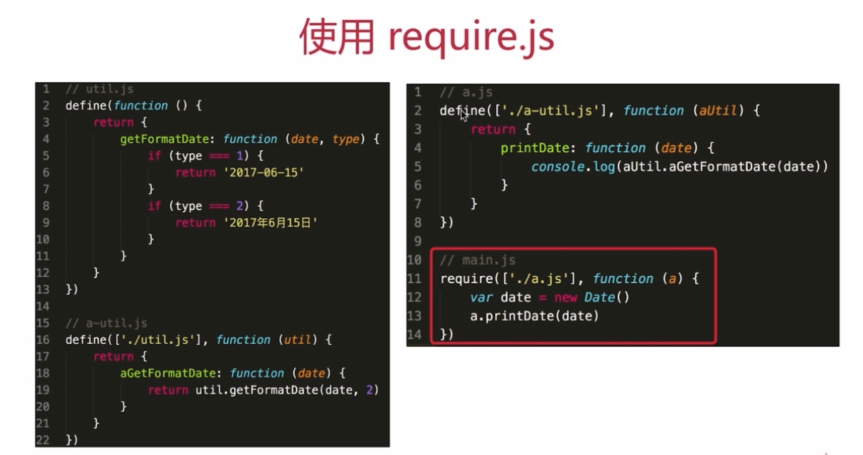

# 开发环境

## IDE ( 编辑器 )

- webstorn
- sublime
- vscode
- atom

## Git ( 版本管理工具 )

- 正式项目都需要代码版本管理
- 大型项目需要多人协作开发
- Git 和 linux是一个作者

### 常见指令

- git add .  
- git checkout XXX  还原
- git commit -m "XXX"  提到本地加备注
- git push origin master  提交服务区
- git pull origin master  下载
- git branch  查看当前分支
- git checkout -b XXX / git checkout XXX  切换分支
- git merge XXX  拷贝

## JS模块化

### 不使用模块化

### 使用模块化


### AMD ( 异步模块定义 )

- require.js
- 全局 define 函数
- 全局 require 函数
- 依赖 JS 会自动、异步加载




### CommonJS 

- nodejs 模块化规范，现被大量用于前端
- 前端开发依赖的插件和库，都可以从 npm 中获取
- 构建工具的高度自动化，使得使用 npm 的成本非常低
- CommonJS 不会异步加载 js ，而是同步一次性加载出来

 

## 打包工具

```js
var path = require('path')
var webpack = require('webpack')

module.exports = {
  // 打包
  context: path.resolve(__dirname, './src'),
  entry: {
    app: './app.js'
  },
  output: {
    path: path.resolve(__dirname, '/dist'),
    filename: 'bundle.js'
  },
  // 压缩
  plugins: [
    new webpack.optimize.UglifyPlugin()
  ]
}
```

## 上线回滚流程

- 上线和回滚的基本流程
- linux基本命令


# 运行环境

## 页面加载过程

### 题目

1. 从输入URL到得到 html 的详细过程

   答：（1）浏览器根据 DNS 服务器找到域名对应的 IP 地址

   ​	（2）向这个 IP 的机器发送 http 请求

   ​	（3）服务器接收、处理返回 http 请求

   ​	（4）浏览器拿到返回内容后渲染页面

2. window.onload 和 DOMContentLoaded 的区别

   答：前者页面加载完全部资源后执行，包含：图片、视频等资源；

   ​	后者 DOM 渲染完成后执行，此时图片、视频等资源还没加载完。

### 知识点

#### 加载资源的形式

- 输入url 加载 html
- 加载 html 中的静态资源

#### 加载一个资源的过程

- 浏览器根据 DNS 服务器等到域名的 IP 地址
- 向这个 IP 的机器发送 http 请求
- 服务器接收、处理并返回 http 请求
- 浏览器得到返回内容

#### 浏览器渲染页面的过程

- 根据 HTML 结构生成 DOM Tree
- 根据 CSS 生成 CSSOM
- 将 DOM 和 CSSOM 整合成 RenderTree
- 根据 RenderTree 开始渲染和展示
- 遇到 `<script>`时，会执行并阻塞渲染

## 性能优化

### 原则

- 多使用内存、缓存或其他方法
- 较少 CPU 计算，减少网络请求

### 从哪入手

#### 加载资源优化

- 静态资源的压缩合并

- 静态资源缓存

- 使用 CDN 让资源加载更快

  

- 使用 SSR 后端渲染，数据直接输出到 HTML 中

  

#### 渲染优化

- CSS 放前边，JS 放后边

- 懒加载

  ```html
  
  <script>
  	var img1 = document.getElementById('img1')
    img1.src = img1.getAttribute('data-realsrc')
  </script>
  ```

- 减少 DOM 查询，对 DOM 查询做缓存

```js
// 为缓存 DOM 查询
var i
for(i=0;i<document.getElementsByTagName('p').length;i++) {
  // todo
}
// 缓存 DOM 查询
var i
var pList = document.getElementsByTagName('p')
for(i = 0; i < pList.length; i++) {
  // todo
}
```

- 减少 DOM 操作，多个操作尽量合并在一起执行

  ```js
  var listNode = document.getElementById('list')
  
  // 要插入 10 个 li 标签
  // 创建一个新的空白的文档片段
  var flag = document.createDocumentFragment()
  var x, li
  for(x = 0; x < 10; x++) {
    li = document.createElement('li')
    li.innerHTML = "List item" + x
    frag.appendChild(li)
  }
  listNode.appendChild(frag) // 合并 DOM 插入
  ```

- 事件节流

  ```js
  var textarea = document.getElementById('text')
  var timeoutId
  textarea.addEventListener('keyup', function() {
    if (timeoutId) {
      clearTimeout(timeoutId)
    }
    timeoutId = setTimeout(function() {
      // 触发 change 事件
    },100)
  })
  ```

- 尽早执行操作 ( 如 DOMContentLoaded )

  ```js
  window.addEventListener('load', function() {
    // 页面上所有资源加载完毕后执行，包含：图片、视频等资源
  })
  window.addEventListener('DOMContentLoaded', function() {
    // DOM 渲染完毕后执行，此时图片、视频等资源未加载完
  })
  ```

## 安全性

- XSS 跨站脚本攻击（cross site scripting）

  ​	概念：发生在目标用户的浏览器层面上，当渲染DOM树的过程发生了不在预期内执行的JS代码时，就发生了XSS攻击。大多数XSS攻击主要方式是嵌入一段远程或者第三方域上的JS代码，并执行了该代码。

  ​	攻击种类：

   - 反射性XSS
   - 存储型XSS
   - DOM XSS
   - 

- CSRF 跨站请求伪造（cross-site request forgery）本质：源于Web的隐式身份验证机制）

  ​	概念：引诱用户在登录的目标网站访问其他攻击页面，利用目标网站对用户的信任，以用户身份在攻击页面发起伪造用户操作的请求，达到攻击目的。

  ​	防御手段：

   - 尽量使用Post，限制get
   - 浏览器cookie策略（不靠谱，只是降低了风险）
   - 加验证码
   - referer check 防止图片盗链
   - 使用token